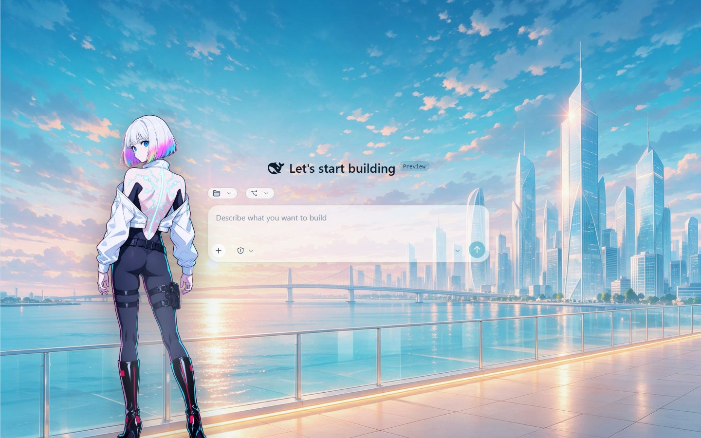
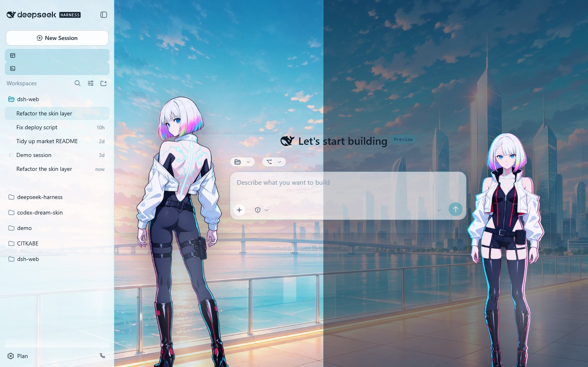
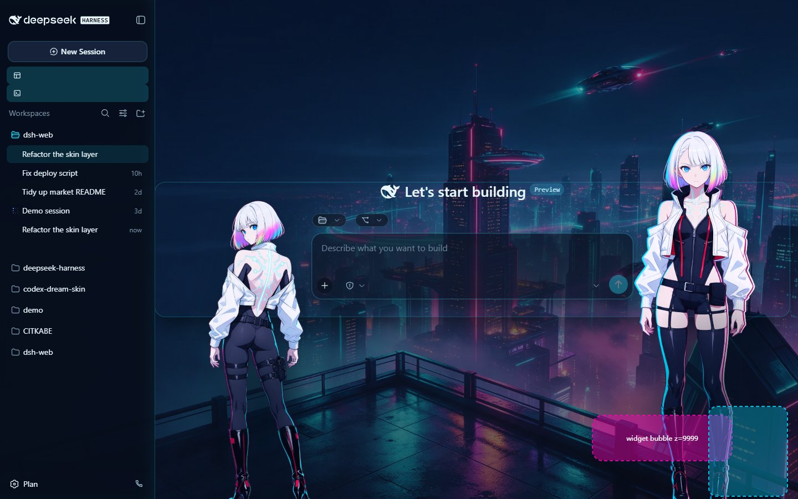

# Lucy · Night City Signal — a DSH skin

English | [中文](README.zh.md)

A cyberpunk fan skin for the DeepSeek Harness web GUI. Light theme: a blue-hour
megacity rooftop above the clouds. Dark theme: a neon night skyline in rain haze.
Two matted portraits of a silver-bob netrunner stand **flush against the left and
right edges of the input card** and follow both side drawers automatically.

| | |
| --- | --- |
| skin id | `lucy-nightsignal` |
| version | 0.1.0 |
| manifest | v2 (`skin.json`, skin-center contract) |
| built against | DSH 0.2.0-rc.2 desktop + `@linxin666/dsh-client-ui-skin-center` 0.4.3 |
| licence | CC BY-NC-SA 4.0 (unofficial fan artwork) |

## What it looks like

Light theme — the narrowed data column keeps its wings free, and the left
portrait's right edge touches the input card:


Dark theme — the larger front-view portrait sits on the input card's right edge:


Both previews are 1440x900 JPEG quality 85, shot through the market's own facade
renderer (`market/dist/preview.html` + `official-facade.js`) — the same static
renderer the Workshop gallery uses. Reproduce them with
`tools/facade/capture-facade.cjs` (see `tools/facade/README.md`).

## Install

### By hand

```powershell
git clone https://github.com/lemonhall/dsh-skin-lucy
Copy-Item -Recurse dsh-skin-lucy\skins\lucy-nightsignal "$env:USERPROFILE\.dsh\skins\"
```

Then open Settings -> Skin Center (or the Creative Workshop card) and pick
`露西·夜城信号`. No restart and no page reload: the Skin Center rescans
`$DSH_HOME/skins` while the card is open.

### From the Workshop

Submitted as `skins/lucy-nightsignal` to
[zhu1090093659/dsh-skins](https://github.com/zhu1090093659/dsh-skins). Once that
lands, the Workshop installs it on demand into `$DSH_HOME/skins/lucy-nightsignal`.
The submission checklist and the ready-to-paste PR text live in
[docs/PR-dsh-skins.md](docs/PR-dsh-skins.md).

## The layout, and why it is built this way

The skin-center contract documents semantic attributes (`data-dsh-surface`,
`data-dsh-part`, `data-pane`) that the shipped 0.2.0 desktop build does **not**
carry. Everything here is therefore built on hooks the real build does expose,
read straight out of `resources/app.asar`:

- the input card is `[data-composer-card]`, so it becomes the geometric anchor:
  the left portrait takes `left: anchor(--lucy-composer left)` plus
  `translate: -100% 0`, the right one takes
  `left: anchor(--lucy-composer right)`. Because the card re-centres whenever a
  drawer moves, **both portraits follow the left rail and the right details pane
  without measuring anything**;
- each portrait's element box is exactly its artwork box (`height` +
  `aspect-ratio` + `width: auto`); with a wider box `background-size: contain`
  centres the drawing and leaves a gap, so the edges could never be flush;
- the portraits paint at `z-index: 900`: above every shell surface (the frame's
  own layers are 15-40) but **below the whale-widget root**, which is fixed at
  `z-index: 9999` on `<body>`. At an equal z-index the tie goes to tree order and
  a pseudo-element is the last child box, so an earlier revision painted over the
  desktop pet's bubble;
- the data column is narrowed through the shell's own knob
  `--dsh-chat-user-width` (with `!important`, because the chat body redefines
  `--dsh-chat-content-width` internally), which is what gives the portraits their
  wings.

There is deliberately **no `hooks.mjs`**: the market preview renderer never
executes skin hooks, and the Skin Center only runs hooks for a user-directory skin
whose bytes match an official market install. Declarative CSS keeps the shop
preview honest. The full write-up, including the two pitfalls that only
measurement catches, is in [docs/SKIN-TECHNIQUE.md](docs/SKIN-TECHNIQUE.md).

### Drawer behaviour, with evidence

| state | what happens |
| --- | --- |
| both drawers shut | both portraits stand in the wings, edges flush with the input card |
| left sidebar collapsed | the card re-centres and the left portrait slides with it to the window edge |
| right details pane open | the card's right edge reaches the pane, so the right portrait stands over the pane instead of disappearing |

Left sidebar collapsed to the 0px rail:



Right details pane open (the darker overlay is the pane area, not part of the skin):



The desktop pet keeps its corner: the mock widget below is a stand-in rendered at
the real `z-index: 9999`, and it paints above the portrait's boots:



## Repository layout

```
skins/lucy-nightsignal/     the skin itself — the directory that gets installed
  skin.json                 manifest v2 (id, palette metadata, contributions)
  skin.css                  L1 token remap (light on :root, dark on body[data-ds-dark-theme])
  patches.css               L3 free selectors: the two portraits, the neon chrome
  assets/                   scene-light, scene-dark, lucy-signal-left, lucy-signal-right
  preview/                  light.jpg + dark.jpg, 1440x900 JPEG q85
  README.md / README.zh.md  the skin's own bilingual readme
docs/ART-PROVENANCE.md      models, prompts, digests, matting recipe
docs/SKIN-TECHNIQUE.md      the layout contract and the measured pitfalls
docs/PR-dsh-skins.md        submission checklist for the dsh-skins repository
docs/shots/                 drawer-state and layering evidence renders
tools/ofox_gen.py           OFOX image generation helper (generation + inspection)
tools/matte.py              chroma-key matting: unmix, despill, alpha floor, despeckle
tools/prompts/              the exact prompts used for every asset
tools/facade/               preview capture + layout measurement through the market facade
```

## How the artwork was made

Every raster asset is AI generated and then processed locally; no photograph,
cosplay image or other third-party picture was sent to the provider (the character
design was described in text only).

1. **Scenes** — `volcengine/doubao-seedream-5.0-pro` through the OFOX images API,
   opaque and people-free: one bright blue-hour rooftop, one neon night skyline.
   Resized to a 1920px long side; the light one also gets a little colour and
   contrast back, because it returns high-key.
2. **Portraits** — the same model, full body, drawn on a flat magenta `#FF00FF`
   plate. They are keyed locally with `tools/matte.py`: estimate the key from the
   border, ramp alpha on the colour distance, unmix
   (`F = (observed - (1 - a) * key) / a`), despill the magenta excess, apply an
   alpha floor and finally a connected-component despeckle. Measured spill after
   matting: 38 and 50 sampled pixels on a 3px grid — negligible.
3. Digests, exact prompts and the per-run inspection reports are recorded in
   [docs/ART-PROVENANCE.md](docs/ART-PROVENANCE.md).

## Verification

Local gates, run against a checkout of the submission target with this skin in
place:

| gate | result |
| --- | --- |
| `node scripts/dsh-skin.cjs validate skins/lucy-nightsignal` | PASS |
| `node scripts/skin-hooks-registry.mjs --check` | OK (no hooks facet, no registry drift) |
| `pnpm skin-center:check` | OK (54 repo catalog skins) |
| `pnpm typecheck` | OK |
| `pnpm test` | 771 passed (52 files) |
| `pnpm build` | OK |
| `git diff --exit-code -- lib` | clean |

On the live GUI: installed and activated, `GET /api/skin-center/v2/catalog` lists
the skin with no diagnostics, and the `stylesheet` / `patches` routes both return
200 after passing the CSS safety pipeline. Light and dark themes were checked with
both drawers open and shut.

## Known trade-offs

- **No hooks**, by design (see above) — so the portraits ride the input card
  instead of measuring the sidebar the way maid-atelier does.
- Anchor positioning needs Chrome 125+ (Chrome 154 and WebView2 143 on the
  development machine). Every anchored declaration carries a plain fallback tuned
  to the sidebar-open geometry, so older engines still place the portraits.
- `patches.css` matches CSS-module hash class names in a few places (`*_frame`,
  `*_sidebarCol`, `*_rightbarCol`, `*_centerCol`); `dsh-skin validate` reports
  that as a warning because an official rebuild could rename them.
- With the details pane open the right portrait stands over the pane. That is
  deliberate: the alternative was hiding her, and no position in that layout
  avoids overlapping something.

## Licence and attribution

CC BY-NC-SA 4.0 — attribution required, non-commercial, share-alike. The depicted
character and setting belong to their rights holders; this is unofficial fan
artwork, unaffiliated with CD Projekt Red or Studio Trigger. See [NOTICE](NOTICE)
and [LICENSE](LICENSE).
