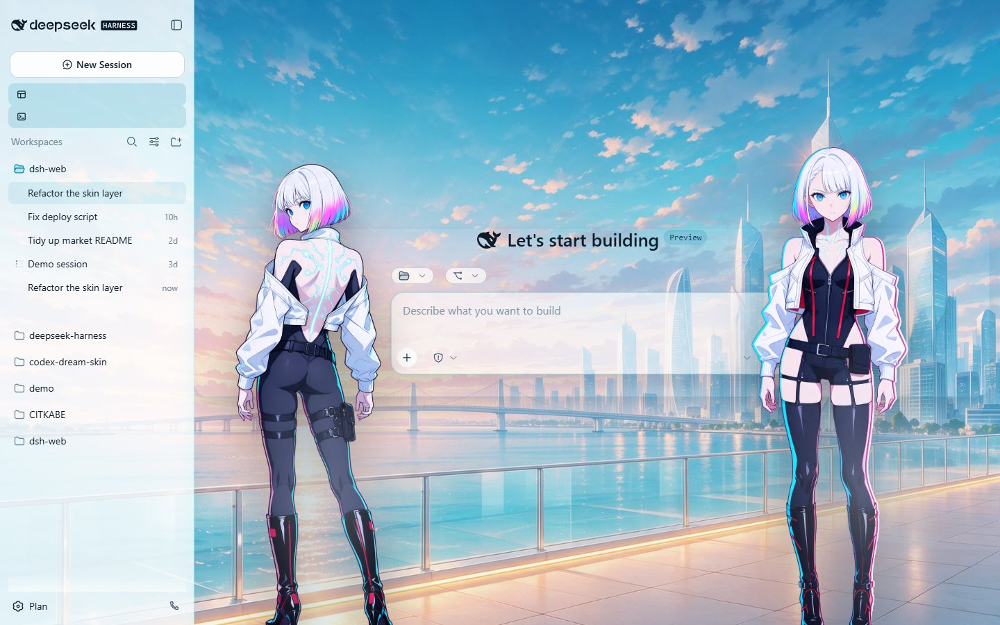
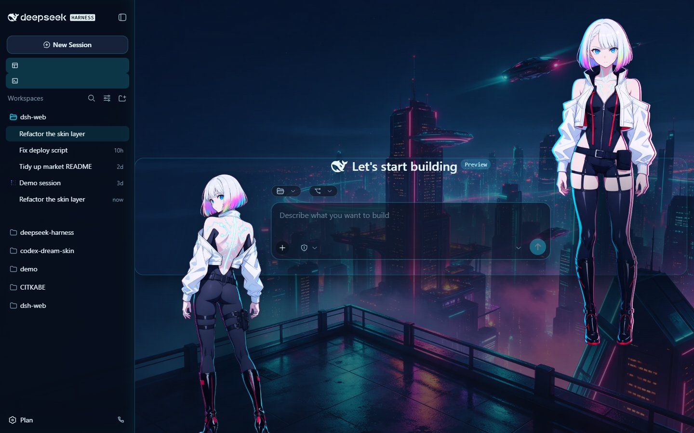

# Lucy · Night City Signal

English | [中文](README.zh.md)

A cyberpunk skin for the dsh web GUI, kept as a pure asset directory: two
blue-hour / neon rooftop scenes and two matted portraits that stand flush against
the left and right edges of the input card and follow both side drawers. No
`package.json`, no build step — the skin center is the only loader.

| | |
| --- | --- |
| id | `lucy-nightsignal` |
| version | 0.1.0 |
| manifest | v2 |
| licence | CC BY-NC-SA 4.0 (unofficial fan artwork) |

## Preview

Light theme:

Dark theme:

Both are 1440x900 JPEG q85, shot through the market's own facade renderer.

## What it is

- `skin.json` (manifest v2) + `skin.css` (L1 token remap: light on `:root`, dark
  on `body[data-ds-dark-theme]`) + `patches.css` (L3: the two portraits and the
  neon chrome).
- The portraits are anchored to `[data-composer-card]`: the left one's right edge
  on the card's left edge (`left: anchor(... left)` + `translate: -100% 0`), the
  right one's left edge on the card's right edge. Because the card re-centres when
  a drawer moves, both follow the left rail and the right details pane without
  measuring anything.
- They paint at `z-index: 900`, above every shell surface but below the whale
  widget (`z-index: 9999` on `<body>`), so the desktop pet keeps its corner.
- No `hooks.mjs`: the market preview renderer never runs skin hooks, so the scene
  is declarative on purpose.

## Provenance and copyright

**The artwork is AI-generated.** Every raster asset under `assets/` was produced with
an image model through the OFOX image API (`volcengine/doubao-seedream-5.0-pro`) and then processed locally: the
scenes by a phosphor duotone pass with halation, then baked scanlines, a vignette and grain; the portraits by chroma-key matting (key estimation, alpha ramp, unmix, despill, alpha floor, connected-component despeckle). **No photograph, cosplay
image, or other third-party picture was given to any model** - the character was
described in text only.

**Character and source work.** The two portraits depict **Lucy / Lucyna Kushinada**
from **Cyberpunk: Edgerunners**. The character design, the work itself and its
setting belong to their rights holders: **Studio TRIGGER** and **CD PROJEKT RED**
(together with their respective licensors and successors).

**Terms of use.** **Personal, non-commercial use only.** This is **unofficial fan
artwork**: it is not affiliated with, endorsed by, sponsored by, or licensed from
Studio TRIGGER, CD PROJEKT RED, the maintainers of this repository, or the DeepSeek
Harness project. All rights to the character and the source work remain with their
rights holders; if a rights holder objects, this skin should be removed.

**Licence of the skin itself.** The skin's own code and styles (`skin.json`,
`skin.css`, `patches.css`, and `hooks.mjs` where present) are released under
**CC BY-NC-SA 4.0** (see the repository `LICENSE`). That licence covers only the
parts authored here and grants no rights to the character or the source work.

## Known limitations

- Presentation only: the skin mutates browser styles and never touches a model
  request.
- Anchor positioning needs Chrome 125+; plain fallbacks cover older engines.
- `patches.css` matches a few CSS-module hash class names, which an official
  rebuild could rename (`dsh-skin validate` warns about this by design).

The full write-up, including the measured pitfalls behind these choices, is in
the project repository under `docs/SKIN-TECHNIQUE.md`.
